markdown
# Project Architecture

## Solution model

The project `MemoAna.slnx` contains the game app and  `MemoAna.Backend.slnx` has the backend projects, which uses one project per DDD layer.
The Game App project is:

- `MemoAna`: Single Project MAUI Blazor Hybrid App.

The Game Backend projects are:

- `MemoAna.Backend`: Presentation.
- `MemoAna.Backend.Application`: Application.
- `MemoAna.Backend.Domain`: Domain.
- `MemoAna.Backend.Infrastructure`: Infrastructure.
- `MemoAna.Backend.Composition`: DI composition.

## Dependency direction

The MemoAna.Backend projects follow the same dependency direction:

```mermaid
%%{init: {"flowchart": {"curve": "basis", "nodeSpacing": 50, "rankSpacing": 50}} }%%
graph TD

    subgraph L1["🖥️ Presentation Layer"]
        MemoAna_Backend["📱 MemoAna.Backend<br/><b><i>.NET Blazor App + WebApi</i></b>"]
    end
    subgraph L2["🧩 Composition Layer"]
        MemoAna_Backend_Composition["📦 MemoAna.Backend.Composition<br/><i>Service Registration<br/>WebaApplicationBuilder.Services</i>"]
    end

    subgraph L3["⚙️ Infrastructure Layer"]
        MemoAna_Backend_Infrastructure["📦 MemoAna.Backend.Infrastructure<br/><i>Persistence / External Services</i>"]
    end

    subgraph L4["🧠 Application Layer"]
        MemoAna_Backend_Application["📦 MemoAna.Backend.Application<br/><i>Use Cases / Services</i>"]
    end

    subgraph L5["💎 Domain Layer"]
        MemoAna_Backend_Domain["📦 MemoAna.Backend.Domain<br/><i>Entities / Value Objects</i>"]
    end

    MemoAna_Backend --> MemoAna_Backend_Application
    MemoAna_Backend --> MemoAna_Backend_Composition
    MemoAna_Backend_Composition --> MemoAna_Backend_Application
    MemoAna_Backend_Composition --> MemoAna_Backend_Infrastructure
    MemoAna_Backend_Infrastructure --> MemoAna_Backend_Application
    MemoAna_Backend_Application --> MemoAna_Backend_Domain

    classDef presentation fill:#4C6EF5,stroke:#364FC7,color:#fff,stroke-width:1px;
    classDef composition fill:#7048E8,stroke:#4C2A9C,color:#fff,stroke-width:1px;
    classDef infra fill:#E64980,stroke:#A61E4D,color:#fff,stroke-width:1px;
    classDef application fill:#12B886,stroke:#087F5B,color:#fff,stroke-width:1px;
    classDef domain fill:#4C7EF5,stroke:#B08900,color:#fff,stroke-width:1px;

    class MemoAna_Backend presentation;
    class MemoAna_Backend_Composition composition;
    class MemoAna_Backend_Infrastructure infra;
    class MemoAna_Backend_Application application;
    class MemoAna_Backend_Domain domain;

    style L1 fill:#0f0f0f,stroke:#4C6EF5,stroke-width:1px
    style L2 fill:#0f0f0f,stroke:#7048E8,stroke-width:1px
    style L3 fill:#0f0f0f,stroke:#E64980,stroke-width:1px
    style L4 fill:#0f0f0F,stroke:#12B886,stroke-width:1px
    style L5 fill:#0f0f0f,stroke:#F59F00,stroke-width:1px
```

